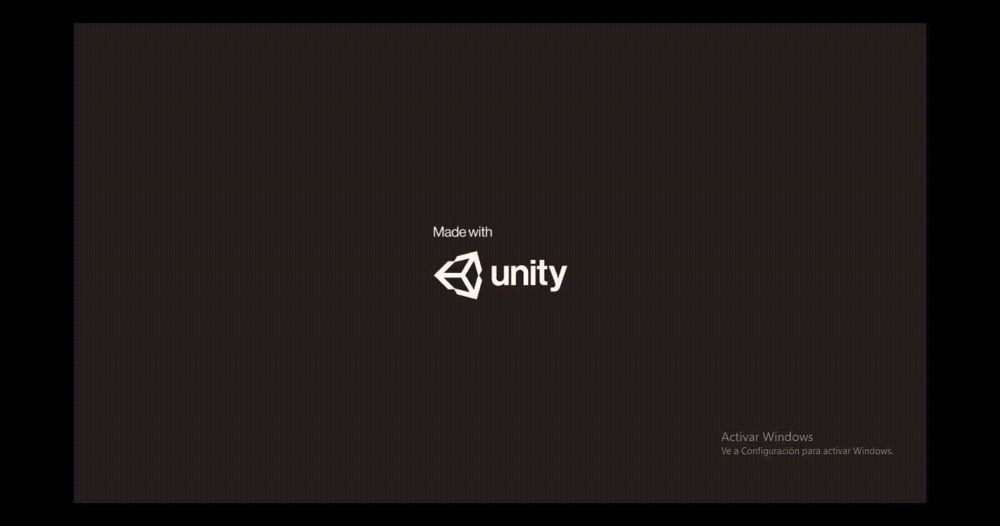

# Aerial Manipulator
<p float="left">
    
 </p>
Code for the simulation of the aerial manipulator 
- [Installation](#installation)
- [Launch](#launch)

## Installation
This is the explanation of how to get the code running on a local machine. First download conda on the local machine.
```bash
wget https://repo.anaconda.com/miniconda/Miniconda3-latest-Linux-x86_64.sh
bash Miniconda3-latest-Linux-x86_64.sh
```
Then, create a new Python 3.7 conda environment (e.g., named "py3-aerial_simulation") and
activate it:

```bash
conda create -n py3-aerial_simulation python=3.7
conda activate py3-aerial_simulation
```
Inside a ROS workspace download the repository in the src folder:
```bash
git clone https://github.com/lfrecalde1/aerial_manipulator.git
```

Then inside aerial_manipulator dolfer install the following dependencies:

```bash
chmod +x install_python.sh
./install_python.sh
```
Due to the virtual env is necessary to configure the catkin workspace as follows:
```bash
catkin_make -DPYTHON_EXECUTABLE=~/miniconda3/envs/py3-aerial_simulation/bin/python
source devel/setup.bash
```
## Launch
This section shows how to execute the simulatation
```bash
roslaunch aerial_manipulator system_dynamics.launch
```
## Unity3D Visualizer
The visualizer of the system can be directly downloaded from the following [link](https://drive.google.com/drive/folders/17Wo6B0ZemvFP613rw5oYRuCEEXydANkR?usp=sharing):
```bash
https://drive.google.com/drive/folders/17Wo6B0ZemvFP613rw5oYRuCEEXydANkR?usp=sharing
```
Then execute the following comands inside the directory of the visualizer:
```bash
chmod +x Manipulador_aereo_V2.x86_64 
./Manipulador_aereo_V2.x86_64 :w
```
The visualizer of the open-access simulator shows an HMI where the user needs to introduce the IP address of the ROS master service.


